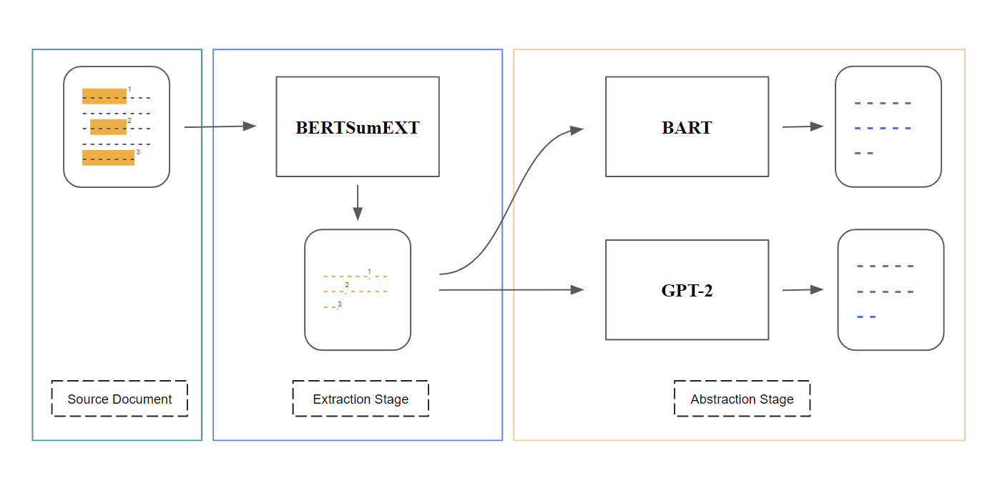
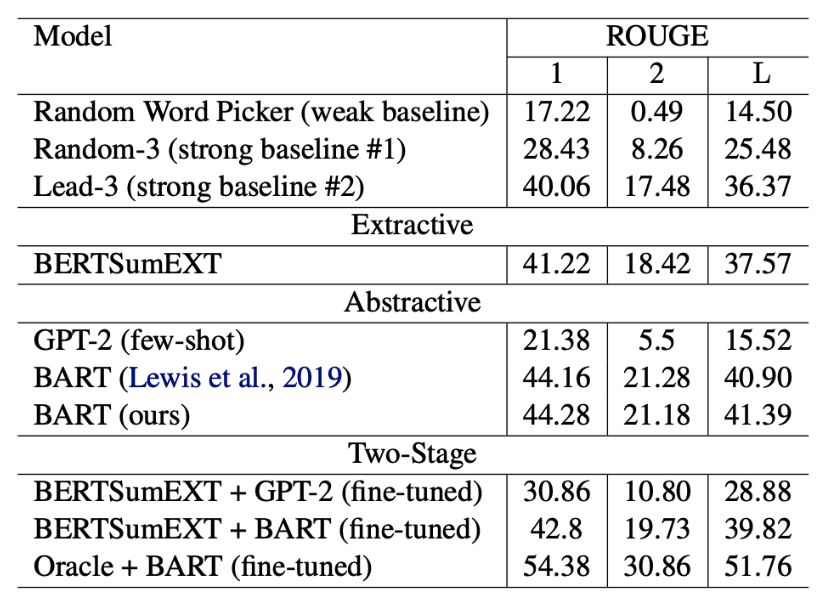

# Two-Stage Text Summarization


## Description
We experiment with a 2-stage summarization model on CNN/DailyMail dataset that combines
the ability to filter informative sentences
(like extractive summarization) and the ability to
paraphrase (like abstractive summarization). Our
best model achieves a ROUGE-L F1 score of
39.82, which outperforms the strong Lead-3 baseline and BERTSumEXT.
Further, fine-tuning both stages on our oracle as the gold references shows the potential to outperform BART.

## Results


## Environment
```bash
conda create -n text-sum python=3.8
conda activate text-sum
pip install -r src/requirements.txt
```

## Extraction stage
See [here](bertsumext/README.md)

## Abstraction stage
See [here](bart/README.md)
